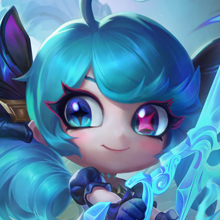
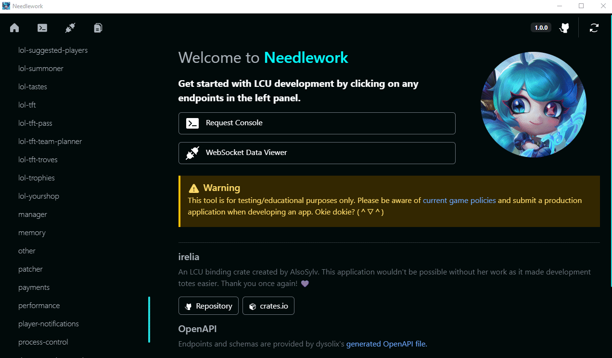

# Needlework

Needlework is an open-source helper tool for the LCU that provides documented endpoints and can send requests without any code setup. Created using Nuxt and Tauri! 🌠

## Download

[Needlework can be downloaded from the latest release! Currently for Windows only.](https://github.com/BlossomiShymae/Needlework/releases)

## Contributors

## Preview

## Development

Rust for tauri depends on nightly toolchain.

Install packages:

`npm i`

Run tauri in development:

`npm run tauri dev`

Compile installer:

`npm run tauri build`

## Limitations

- WebSocket viewer cannot reconnect to the League client if the client is restarted. The Restart Application button can be used as a workaround for now. c:

## Credits

### irelia

An LCU binding crate created by AlsoSylv. This application wouldn't be possible without her work as it made development totes easier. Thank you once again! 💜
- [Repository](https://github.com/AlsoSylv/Irelia)
- [crates.io](https://crates.io/crates/irelia)

### LCU Explorer

This project was inspired by LCU Explorer, an application created by the HextechDocs team! 💚
- [Repository](https://github.com/HextechDocs/lcu-explorer)

### hasagi-types

Endpoints and schemas are provided by dysolix's [generated OpenAPI file.](https://raw.githubusercontent.com/dysolix/hasagi-types/main/swagger.json) Thank you!
- [Repository](https://github.com/dysolix/hasagi-types)

## Disclaimer
Needlework isn't endorsed by Riot Games and doesn't
reflect the views or opinions of Riot Games or anyone officially
involved in producing or managing Riot Games properties. Riot Games,
and all associated properties are trademarks or registered
trademarks of Riot Games, Inc.
